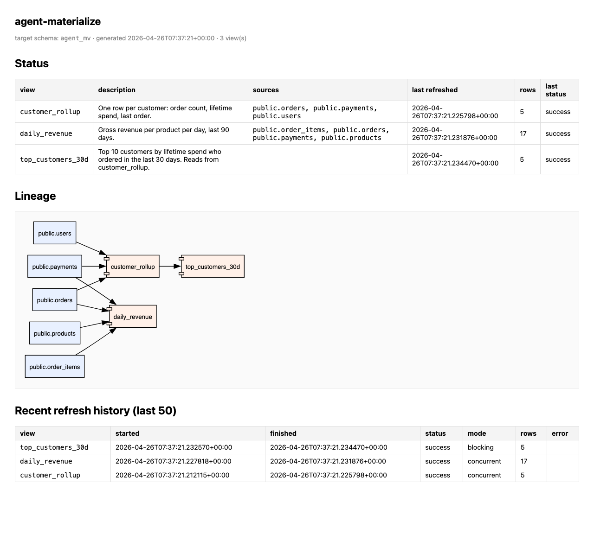

# agent-materialize demo

A self-contained, runnable demo of the full `agent-mv` flow against a throwaway Postgres in Docker. From `./run.sh` to a rendered dashboard in about 30 seconds. Tears down with `./run.sh down`.

This is what gets exercised:

- a tiny e-commerce schema (`users`, `products`, `orders`, `order_items`, `payments`) seeded with ~50 rows
- three materialized views — including **one that depends on another view**, so you see the lineage graph render and the topological refresh order
- `agent-mv apply` creates the `agent_mv` schema, the two roles, the views, the lineage table, and the `SECURITY DEFINER` refresh function
- `agent-mv doctor` proves the runtime role *cannot* read `public.*` — enforced by Postgres, not by the application
- `agent-mv refresh-all` walks the lineage and refreshes in dependency order
- `agent-mv dashboard build` renders a static `dashboard.html` (status table, refresh history, lineage SVG)
- a final `psql` call queries the views as the runtime role and tries — and fails — to read base tables

## Prereqs

- Docker (Desktop or daemon) running
- `graphviz` for the dashboard's SVG: `brew install graphviz` / `apt install graphviz`
- Either `agent-mv` on `PATH` (after `uv tool install .` from the repo root) **or** `uv` (the script falls back to `uv run` from the repo)

## Run it

```bash
cd examples/demo
./run.sh
```

Open the printed `file://…/dashboard.html` link.

## What you should see

The rendered dashboard (`agent-mv dashboard build`):



Status table, lineage SVG (note the `customer_rollup → top_customers_30d` MV-on-MV arrow), and refresh history with `mode=concurrent` for the indexed views and `mode=blocking` for `top_customers_30d` — that's `agent-mv` picking `REFRESH MATERIALIZED VIEW CONCURRENTLY` automatically when a unique index exists.

And the terminal output, captured verbatim from a real run. The exact `lifetime_value_cents` numbers depend on `now()` at refresh time — for the seeded data they land at the values below.

```
==> agent-mv apply  (creates roles, schema, 3 views, lineage)
✓ applied 3 view(s)

==> agent-mv doctor  (proves runtime role cannot read base tables)
✓ access boundary verified (runtime role cannot read base tables)

==> agent-mv refresh-all  (topological order: customer_rollup → top_customers_30d)
✓ refreshed customer_rollup
✓ refreshed daily_revenue
✓ refreshed top_customers_30d

==> agent-mv status  (rich-table view of current state, post-refresh)
                            agent-materialize: views
┏━━━━━━━━━━━━━━━━━━┳━━━━━━┳━━━━━━━━━━━━━━━━━━━┳━━━━━━━━━━━━━┳━━━━━━━━━━━━━━━━━━┓
┃ name             ┃ rows ┃ last_refreshed_at ┃ last_status ┃ sources          ┃
┡━━━━━━━━━━━━━━━━━━╇━━━━━━╇━━━━━━━━━━━━━━━━━━━╇━━━━━━━━━━━━━╇━━━━━━━━━━━━━━━━━━┩
│ customer_rollup  │ 5    │ 2026-04-26T07:33… │ success     │ public.orders,   │
│                  │      │                   │             │ public.payments, │
│                  │      │                   │             │ public.users     │
│ daily_revenue    │ 17   │ 2026-04-26T07:33… │ success     │ public.order_it… │
│                  │      │                   │             │ public.orders,   │
│                  │      │                   │             │ public.payments, │
│                  │      │                   │             │ public.products  │
│ top_customers_3… │ 5    │ 2026-04-26T07:33… │ success     │ agent_mv.custom… │
└──────────────────┴──────┴───────────────────┴─────────────┴──────────────────┘

==> agent-mv dashboard build
✓ wrote dashboard.html

==> querying agent_mv.top_customers_30d as the runtime role
       email       | order_count | lifetime_value_cents
-------------------+-------------+----------------------
 carol@example.com |           3 |                25900
 alice@example.com |           3 |                24400
 bob@example.com   |           2 |                19400
 eve@example.com   |           1 |                12400
 dave@example.com  |           1 |                 6000
(5 rows)

==> proving the boundary: same role trying to read public.users
ERROR:  permission denied for table users
  ✓ blocked by Postgres, as expected

Dashboard: file:///…/examples/demo/dashboard.html
```

The third status row's `sources` column shows `agent_mv.customer_rollup` rather than base-table names — that's the MV-on-MV dependency, picked up by sqlglot at apply-time and used by `refresh-all` to pick the right order. The dashboard SVG visualizes the same graph.

`top_customers_30d` deliberately omits a unique index, so its refresh runs as plain (AccessExclusive-locking) `REFRESH MATERIALIZED VIEW`. Fine for a demo; on a hot view in a real project you'd add a unique index so `agent-mv` picks `REFRESH MATERIALIZED VIEW CONCURRENTLY` automatically.

## Tear down

```bash
./run.sh down
```

Removes the container, volume, generated `.env`, and `dashboard.html`. Re-run `./run.sh` any time.

## Files

| File | What it is |
|---|---|
| `docker-compose.yml`            | Postgres 16 on port 55432, seeded on first boot |
| `seed.sql`                      | The ~50-row e-commerce schema |
| `materialize.yaml`              | Three views, with one MV-on-MV dependency |
| `materialize/customer_rollup.sql`    | Lifetime stats per customer |
| `materialize/daily_revenue.sql`      | Per-product, per-day revenue (90d window) |
| `materialize/top_customers_30d.sql`  | Reads from `agent_mv.customer_rollup` — exercises lineage |
| `.env.example`                  | Demo DSNs (copied to `.env` by `run.sh`) |
| `run.sh`                        | The whole flow, idempotent; `down` subcommand to tear down |
